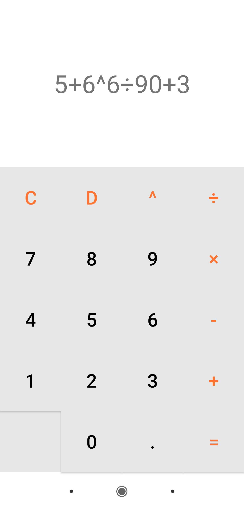

# App Calculadora

Um app de calculadora bem simples feito com Android SDK na IDE Android Studio.

Neste aplicativo podem ser realizadas as 4 operações básicas da aritmética além de potências. Este app suporta expressões com mais de 3 termos porém alguns bugs podem ocorrer com expressões mais complexas.

O layout foi feito usando o componente ConstraintLayout.

  
  

